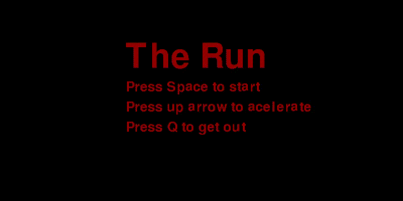

# Repositorio simples, de jogos feitos em Python
______

* The Run (Demo) um  jogo simples de corrida estilo Ray casting

#### Requisitos 

 * import pygame
 * import sys
* from random import randrange,choice,random,randint

The_Run/img/The_Run.gif

* No Mercy_Demo
### Jogo Demo , que tem como simples funçao testar as funçoes basicas(colisao,som,movimentaçao) da biblioteca Pygame,

