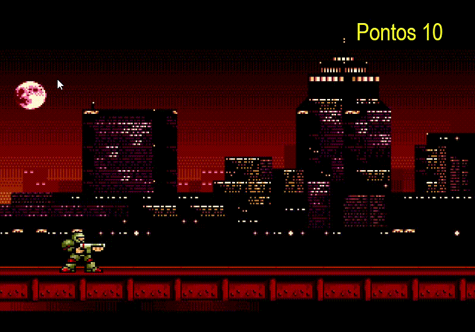
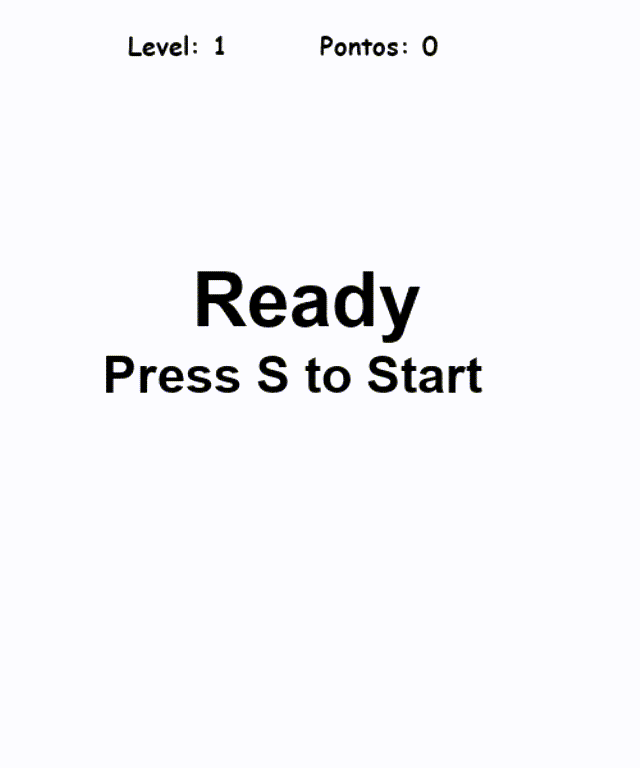

# Repositorio simples, de jogos feitos em Python
______

 ## The Run (Demo) um  jogo simples de corrida estilo Ray casting

#### Requisitos 

 * import pygame
 * import sys
* from random import randrange,choice,random,randint

## No Mercy_Demo

### Jogo Demo , que tem como simples funçao testar as funçoes basicas(colisao,som,movimentaçao) da biblioteca Pygame,

#### Requisitos 

 * import pygame
 * import sys
* from random import randrange,choice,random,randint

## Tetris

### Tetris simples desenvolvido com biblioteca Pygame,

#### Requisitos 

 * import pygame,sys,os,random
 * from pygame import 
 * from pygame.locals import 

